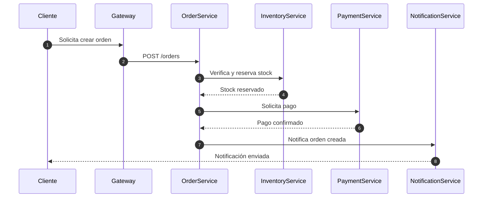
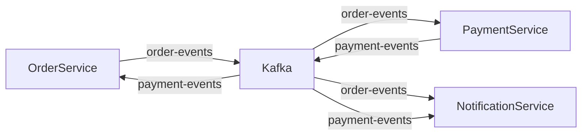
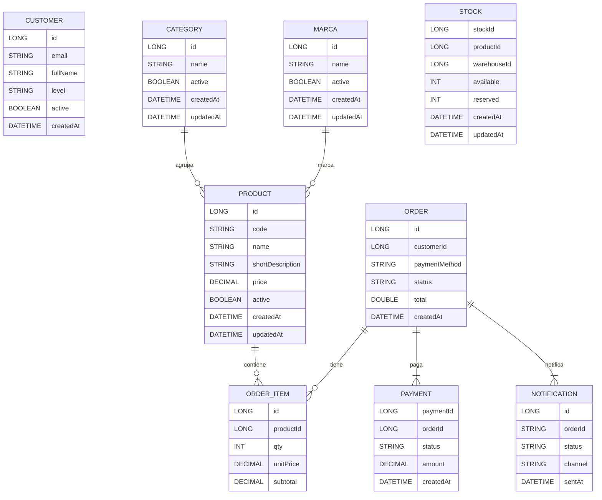
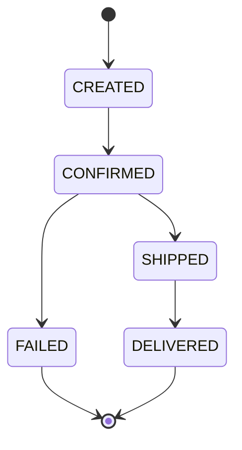
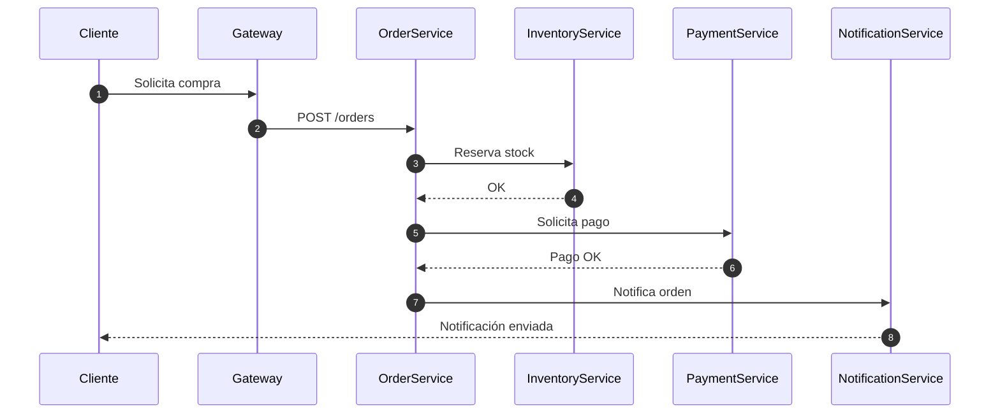

# Proyecto Ecommerce - Arquitectura de Microservicios

---

## Índice de Contenidos

- [Descripción General](#descripción-general)
- [Arquitectura Global](#arquitectura-global)
- [Flujos de Negocio Principales](#flujos-de-negocio-principales)
- [Uso de Kafka](#uso-de-kafka)
- [Bases de Datos](#bases-de-datos)
- [Resiliencia y Seguridad](#resiliencia-y-seguridad)
- [Happy Path Global](#happy-path-global)
- [Contacto](#contacto)

---

## Descripción General

Este documento describe la arquitectura de los microservicios del sistema ecommerce. El sistema está compuesto por microservicios independientes que colaboran para gestionar clientes, productos, inventario, pedidos, pagos y notificaciones.

**Versión global:** Spring Boot 3.3.4 / 3.5.5 (según microservicio)

---

## Diagrama de arquitectura global

```mermaid
flowchart TD
  %% Componentes principales
  subgraph Gateway
    APIGW(API Gateway)
  end

  subgraph Discovery
    Eureka(Eureka Server)
  end

  subgraph Config
    ConfigServer(Config Server)
    ConfigRepo[(config-repo)]
  end

  subgraph Observability
    Zipkin(Zipkin)
  end

  subgraph KafkaBroker
    Kafka(Kafka)
  end

  subgraph Customer
    CustomerService(Customer Service)
    CustomerDB[(customerdb)]
  end

  subgraph Catalog
    CatalogService(Catalog Service)
    CatalogDB[(catalogdb)]
  end

  subgraph Inventory
    InventoryService(Inventory Service)
    InventoryDB[(inventorydb)]
  end

  subgraph Order
    OrderService(Order Service)
    OrderDB[(orderdb)]
  end

  subgraph Payment
    PaymentService(Payment Service)
    PaymentDB[(paymentdb)]
  end

  subgraph Notification
    NotificationService(Notification Service)
    NotificationDB[(notificationdb)]
  end

  %% API Gateway
  APIGW -- REST/Feign --> CustomerService
  APIGW -- REST/Feign --> CatalogService
  APIGW -- REST/Feign --> InventoryService
  APIGW -- REST/Feign --> OrderService
  APIGW -. Eureka Discovery .-> Eureka
  APIGW -. Config .-> ConfigServer

  %% Eureka y Config Server
  CustomerService -. Eureka .-> Eureka
  CatalogService -. Eureka .-> Eureka
  InventoryService -. Eureka .-> Eureka
  OrderService -. Eureka .-> Eureka
  PaymentService -. Eureka .-> Eureka
  NotificationService -. Eureka .-> Eureka

  CustomerService -. Config .-> ConfigServer
  CatalogService -. Config .-> ConfigServer
  InventoryService -. Config .-> ConfigServer
  OrderService -. Config .-> ConfigServer
  PaymentService -. Config .-> ConfigServer
  NotificationService -. Config .-> ConfigServer

  ConfigServer -- Git --> ConfigRepo

  %% Bases de datos
  CustomerService -- DB --> CustomerDB
  CatalogService -- DB --> CatalogDB
  InventoryService -- DB --> InventoryDB
  OrderService -- DB --> OrderDB
  PaymentService -- DB --> PaymentDB
  NotificationService -- DB --> NotificationDB

  %% Comunicación REST/Feign
  OrderService -- REST/Feign --> CustomerService
  OrderService -- REST/Feign --> CatalogService
  OrderService -- REST/Feign --> InventoryService

  %% Kafka (eventos)
  OrderService -. Kafka: ORDER_CREATED .-> Kafka
  PaymentService -. Kafka: ORDER_CREATED .-> Kafka
  PaymentService -. Kafka: PAYMENT_CONFIRMED/FAILED .-> Kafka
  NotificationService -. Kafka: ORDER_CONFIRMED .-> Kafka

  Kafka -. ORDER_CREATED .-> PaymentService
  Kafka -. PAYMENT_CONFIRMED/FAILED .-> OrderService
  Kafka -. ORDER_CONFIRMED .-> NotificationService

  %% Observabilidad
  CustomerService -. Trace .-> Zipkin
  CatalogService -. Trace .-> Zipkin
  InventoryService -. Trace .-> Zipkin
  OrderService -. Trace .-> Zipkin
  PaymentService -. Trace .-> Zipkin
  NotificationService -. Trace .-> Zipkin
  APIGW -. Trace .-> Zipkin

  %% Leyenda
  classDef reststroke stroke-width:2,stroke:#222;
  classDef kafka stroke-dasharray: 5 5;
  classDef configeureka stroke-dasharray: 2 2;
  class APIGW,CustomerService,CatalogService,InventoryService,OrderService,PaymentService,NotificationService reststroke;
  class Kafka kafka;
  class Eureka,ConfigServer configeureka;
  ```

---

## Diagrama de Clases

```mermaid
classDiagram
  namespace Infraestructura {
    class EurekaService
    class Kafka
    class KafkaUI
    class DB_Customer
    class DB_Catalog
    class DB_Inventory
    class DB_Order
    class DB_Payment
    class DB_Notification
  }
  namespace Core {
    class CustomerService
    class CatalogService
    class InventoryService
    class OrderService
    class PaymentService
    class NotificationService
  }
  CustomerService --> DB_Customer
  CatalogService --> DB_Catalog
  InventoryService --> DB_Inventory
  OrderService --> DB_Order
  PaymentService --> DB_Payment
  NotificationService --> DB_Notification

  CustomerService ..> EurekaService
  CatalogService ..> EurekaService
  InventoryService ..> EurekaService
  OrderService ..> EurekaService
  PaymentService ..> EurekaService
  NotificationService ..> EurekaService

  OrderService ..> Kafka : produce/consume
  PaymentService ..> Kafka : produce/consume
  NotificationService ..> Kafka : consume
  KafkaUI ..> Kafka

  %% Notas explicativas
  note for CustomerService "Gestión de clientes"
  note for CatalogService "Gestión de productos y catálogos"
  note for InventoryService "Gestión de stock y almacenes"
  note for OrderService "Gestión de pedidos y orquestación"
  note for PaymentService "Gestión de pagos"
  note for NotificationService "Notificaciones de pedidos"
  note for EurekaService "Service Discovery"
  note for Kafka "Mensajería de eventos"
  note for KafkaUI "UI de monitoreo Kafka"
```

---

## Flujos de Negocio

### Creación de Orden

| Paso | Servicio         | Acción                        |
|------|------------------|------------------------------|
| 1    | Cliente          | Solicita creación de orden   |
| 2    | OrderService     | Valida stock y cliente       |
| 3    | InventoryService | Reserva stock                |
| 4    | PaymentService   | Procesa pago                 |
| 5    | NotificationService | Envía notificación        |



---

## Uso de Kafka

| Tópico          | Productores      | Consumidores                |
|-----------------|------------------|-----------------------------|
| order-events    | OrderService     | PaymentService, NotificationService |
| payment-events  | PaymentService   | OrderService, NotificationService   |



---

## Bases de Datos

| Microservicio        | Base de Datos      |
|----------------------|-------------------|
| CustomerService      | customerdb        |
| CatalogService       | catalogdb         |
| InventoryService     | inventorydb       |
| OrderService         | orderdb           |
| PaymentService       | paymentdb         |
| NotificationService  | notificationdb    |



---

## Resiliencia y Seguridad

- **Service Discovery:** Uso de Eureka para registro y descubrimiento de servicios.
- **Mensajería:** Kafka para eventos de dominio y comunicación asíncrona.
- **API Gateway:** Creación de un punto unico de aaceso
- **Resiliencia:** Uso de Feign (Inventory y OrderService).



---

## Happy Path Global



---

## Contacto

- **Cliente:** Protecto final NTTDATA-ESCUELA
- **Service Provider:** com.escuelajavag4, com.nttdata (según microservicio)
- **Desarrolladores responsables:**
    - Adrianzén Carlos (cd28dev)
    - Bobadilla José (joalf1994)
    - Castro Sandro (gopherss)

---
# Arquitectura de Microservicios

---

## Índice de Contenidos

- [Descripción General](#descripción-general)
- [Arquitectura Global](#arquitectura-global)
- [Flujos de Negocio Principales](#flujos-de-negocio-principales)
- [Uso de Kafka](#uso-de-kafka)
- [Bases de Datos](#bases-de-datos)
- [Resiliencia y Seguridad](#resiliencia-y-seguridad)
- [Happy Path Global](#happy-path-global)
- [Contacto](#contacto)

---

## Descripción General

Este documento describe la arquitectura de los microservicios del sistema ecommerce. El sistema está compuesto por microservicios independientes que colaboran para gestionar clientes, productos, inventario, pedidos, pagos y notificaciones.

**Versión global:** Spring Boot 3.3.4 / 3.5.5 (según microservicio)

---

## Diagrama de arquitectura global

```mermaid
flowchart TD
  %% Componentes principales
  subgraph Gateway
    APIGW(API Gateway)
  end

  subgraph Discovery
    Eureka(Eureka Server)
  end

  subgraph Config
    ConfigServer(Config Server)
    ConfigRepo[(config-repo)]
  end

  subgraph Observability
    Zipkin(Zipkin)
  end

  subgraph KafkaBroker
    Kafka(Kafka)
  end

  subgraph Customer
    CustomerService(Customer Service)
    CustomerDB[(customerdb)]
  end

  subgraph Catalog
    CatalogService(Catalog Service)
    CatalogDB[(catalogdb)]
  end

  subgraph Inventory
    InventoryService(Inventory Service)
    InventoryDB[(inventorydb)]
  end

  subgraph Order
    OrderService(Order Service)
    OrderDB[(orderdb)]
  end

  subgraph Payment
    PaymentService(Payment Service)
    PaymentDB[(paymentdb)]
  end

  subgraph Notification
    NotificationService(Notification Service)
    NotificationDB[(notificationdb)]
  end

  %% API Gateway
  APIGW -- REST/Feign --> CustomerService
  APIGW -- REST/Feign --> CatalogService
  APIGW -- REST/Feign --> InventoryService
  APIGW -- REST/Feign --> OrderService
  APIGW -. Eureka Discovery .-> Eureka
  APIGW -. Config .-> ConfigServer

  %% Eureka y Config Server
  CustomerService -. Eureka .-> Eureka
  CatalogService -. Eureka .-> Eureka
  InventoryService -. Eureka .-> Eureka
  OrderService -. Eureka .-> Eureka
  PaymentService -. Eureka .-> Eureka
  NotificationService -. Eureka .-> Eureka

  CustomerService -. Config .-> ConfigServer
  CatalogService -. Config .-> ConfigServer
  InventoryService -. Config .-> ConfigServer
  OrderService -. Config .-> ConfigServer
  PaymentService -. Config .-> ConfigServer
  NotificationService -. Config .-> ConfigServer

  ConfigServer -- Git --> ConfigRepo

  %% Bases de datos
  CustomerService -- DB --> CustomerDB
  CatalogService -- DB --> CatalogDB
  InventoryService -- DB --> InventoryDB
  OrderService -- DB --> OrderDB
  PaymentService -- DB --> PaymentDB
  NotificationService -- DB --> NotificationDB

  %% Comunicación REST/Feign
  OrderService -- REST/Feign --> CustomerService
  OrderService -- REST/Feign --> CatalogService
  OrderService -- REST/Feign --> InventoryService

  %% Kafka (eventos)
  OrderService -. Kafka: ORDER_CREATED .-> Kafka
  PaymentService -. Kafka: ORDER_CREATED .-> Kafka
  PaymentService -. Kafka: PAYMENT_CONFIRMED/FAILED .-> Kafka
  NotificationService -. Kafka: ORDER_CONFIRMED .-> Kafka

  Kafka -. ORDER_CREATED .-> PaymentService
  Kafka -. PAYMENT_CONFIRMED/FAILED .-> OrderService
  Kafka -. ORDER_CONFIRMED .-> NotificationService

  %% Observabilidad
  CustomerService -. Trace .-> Zipkin
  CatalogService -. Trace .-> Zipkin
  InventoryService -. Trace .-> Zipkin
  OrderService -. Trace .-> Zipkin
  PaymentService -. Trace .-> Zipkin
  NotificationService -. Trace .-> Zipkin
  APIGW -. Trace .-> Zipkin

  %% Leyenda
  classDef reststroke stroke-width:2,stroke:#222;
  classDef kafka stroke-dasharray: 5 5;
  classDef configeureka stroke-dasharray: 2 2;
  class APIGW,CustomerService,CatalogService,InventoryService,OrderService,PaymentService,NotificationService reststroke;
  class Kafka kafka;
  class Eureka,ConfigServer configeureka;
  ```

---

## Diagrama de Clases

```mermaid
classDiagram
  namespace Infraestructura {
    class EurekaService
    class Kafka
    class KafkaUI
    class DB_Customer
    class DB_Catalog
    class DB_Inventory
    class DB_Order
    class DB_Payment
    class DB_Notification
  }
  namespace Core {
    class CustomerService
    class CatalogService
    class InventoryService
    class OrderService
    class PaymentService
    class NotificationService
  }
  CustomerService --> DB_Customer
  CatalogService --> DB_Catalog
  InventoryService --> DB_Inventory
  OrderService --> DB_Order
  PaymentService --> DB_Payment
  NotificationService --> DB_Notification

  CustomerService ..> EurekaService
  CatalogService ..> EurekaService
  InventoryService ..> EurekaService
  OrderService ..> EurekaService
  PaymentService ..> EurekaService
  NotificationService ..> EurekaService

  OrderService ..> Kafka : produce/consume
  PaymentService ..> Kafka : produce/consume
  NotificationService ..> Kafka : consume
  KafkaUI ..> Kafka

  %% Notas explicativas
  note for CustomerService "Gestión de clientes"
  note for CatalogService "Gestión de productos y catálogos"
  note for InventoryService "Gestión de stock y almacenes"
  note for OrderService "Gestión de pedidos y orquestación"
  note for PaymentService "Gestión de pagos"
  note for NotificationService "Notificaciones de pedidos"
  note for EurekaService "Service Discovery"
  note for Kafka "Mensajería de eventos"
  note for KafkaUI "UI de monitoreo Kafka"
```

---

## Flujos de Negocio

### Creación de Orden

| Paso | Servicio         | Acción                        |
|------|------------------|------------------------------|
| 1    | Cliente          | Solicita creación de orden   |
| 2    | OrderService     | Valida stock y cliente       |
| 3    | InventoryService | Reserva stock                |
| 4    | PaymentService   | Procesa pago                 |
| 5    | NotificationService | Envía notificación        |


---

## Uso de Kafka

| Tópico          | Productores      | Consumidores                |
|-----------------|------------------|-----------------------------|
| order-events    | OrderService     | PaymentService, NotificationService |
| payment-events  | PaymentService   | OrderService, NotificationService   |


---

## Bases de Datos

| Microservicio        | Base de Datos      |
|----------------------|-------------------|
| CustomerService      | customerdb        |
| CatalogService       | catalogdb         |
| InventoryService     | inventorydb       |
| OrderService         | orderdb           |
| PaymentService       | paymentdb         |
| NotificationService  | notificationdb    |


---

## Resiliencia y Seguridad

- **Service Discovery:** Uso de Eureka para registro y descubrimiento de servicios.
- **Mensajería:** Kafka para eventos de dominio y comunicación asíncrona.
- **API Gateway:** Creación de un punto unico de aaceso
- **Resiliencia:** Uso de Feign (Inventory y OrderService).


---

## Happy Path Global


---

## Contacto

- **Cliente:** Protecto final NTTDATA-ESCUELA
- **Service Provider:** com.escuelajavag4, com.nttdata (según microservicio)
- **Desarrolladores responsables:**
    - Adrianzén Carlos (cd28dev)
    - Bobadilla José (joalf1994)
    - Castro Sandro (gopherss)

---
